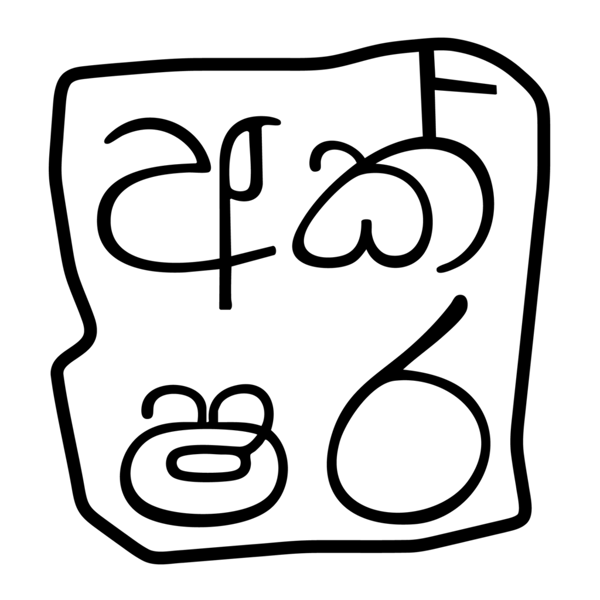

<p align="center">
  
</p>

<h1 align="center">Akshara for macOS</h1>

<p align="center">
  <strong>A lightweight, ultra-fast, clean-room native Sinhala Input Method Engine (IME) designed specifically for modern macOS.</strong>
</p>

<p align="center">
  <a href="https://github.com/AksharaOrg/akshara-mac/releases"></a>
  
  
  <a href="LICENSE"></a>
  
  
</p>

---

## Overview

**Akshara** brings seamless, high-performance Sinhala typing to macOS. Built from the ground up utilizing Apple's native **InputMethodKit (IMK)**, **Carbon TIS (Text Input Source)**, and **SwiftUI**, Akshara delivers zero-latency inline text composition without background daemons, memory leaks, or privacy concerns.

Whether you prefer rapid **Smart Phonetic**, standard **Singlish Phonetic**, or traditional **SLS 1134 (Wijesekara)** layout with real-time visual kombuva reordering, Akshara caters to writers, developers, translators, and everyday users alike.

---

## Key Highlights

- **Zero-Latency Native IME**: Engineered in native Objective-C and Swift for instant keystroke processing.
- **Three Distinct Input Modes**:
  - **`Akshara - Smart Phonetic`**: Accelerated modern phonetic typing with intuitive shorthand keys and automatic conjuncts.
  - **`Akshara - Phonetic`**: Classic romanized Sinhala transliteration.
  - **`Akshara - Wijesekara (SLS 1134)`**: Full compliance with Sri Lanka standard SLS 1134 keyboard layout with live visual-to-Unicode reordering.
- **Interactive Wijesekara Keyboard Viewer**: Live macOS on-screen keyboard viewer with interactive Shift & Option layer visualization.
- **Quick Guide & Cheat Sheet**: Instant access to phonetic rules and vowel signs directly from the macOS input menu bar.
- **Double-Space Period**: Pressing `Space` twice automatically inserts `. ` across all input modes.
- **Built-in Auto Updater**: Background release checks and convenient in-app update prompts via GitHub Releases.
- **Clean, Secure & Private**: No analytics, keylogging, or telemetry. The built-in updater contacts the Akshara GitHub Releases API and downloads signed update packages; opening the GitHub repository from the welcome screen also opens an external web page.

---

## Input Modes & Typing Guide

```
┌──────────────────────────────────────┬─────────────────────────────────────────────────────────────┐
│ Input Source (System Settings)       │ Description                                                 │
├──────────────────────────────────────┼─────────────────────────────────────────────────────────────┤
│  Akshara - Smart Phonetic            │ Accelerated phonetic typing (e.g. 'Aa' ➔ 'ඈ', 'x' ➔ 'ං')    │
│  Akshara - Phonetic                  │ Classic romanized Sinhala transliteration                   │
│  Akshara - Wijesekara (SLS 1134)     │ Standard Wijesekara layout with live vowel reordering       │
└──────────────────────────────────────┴─────────────────────────────────────────────────────────────┘
```

---

### 1. Smart Phonetic Mode

Smart Phonetic simplifies typing complex Sinhala glyphs into intuitive Latin keystrokes:

#### 🔹 Vowels (ස්වර)
| Sinhala | Keystrokes | Sinhala | Keystrokes | Sinhala | Keystrokes |
| :---: | :--- | :---: | :--- | :---: | :--- |
| **අ** | `a` | **ආ** | `aa` | **ඇ** | `A` |
| **ඈ** | `Aa` / `AA` | **ඉ** | `i` | **ඊ** | `ii` / `I` |
| **උ** | `u` / `U` | **ඌ** | `uu` / `Uu` / `UU` | **ඍ** | `R` |
| **ඎ** | `Ru` | **එ** | `e` | **ඒ** | `ee` |
| **ඓ** | `ai` / `E` | **ඔ** | `o` / `O` | **ඕ** | `oo` / `Oo` / `OO` |
| **ඖ** | `au` / `ou` | | | | |

#### 🔹 Consonants (ව්‍යංජන)
| Sinhala | Keystrokes | Sinhala | Keystrokes | Sinhala | Keystrokes |
| :---: | :--- | :---: | :--- | :---: | :--- |
| **ක** | `ka` / `ca` | **ග** | `ga` | **ච** | `cha` |
| **ජ** | `ja` | **ට** | `ta` | **ඩ** | `da` |
| **ත** | `tha` | **ද** | `dha` / `q` | **න** | `na` |
| **ණ** | `N` | **ප** | `pa` | **බ** | `ba` |
| **ම** | `ma` | **ය** | `ya` | **ර** | `ra` |
| **ල** | `la` | **ළ** | `L` | **ව** | `w` / `v` / `Wa` / `Va` |
| **ස** | `sa` | **ශ** | `sha` | **ෂ** | `Sa` / `Sha` |
| **හ** | `ha` | **ෆ** | `fa` | **ඞ** | `X` |

#### 🔹 Mahaprana (මහාප්‍රාණ) & Sanyaka (සඤ්ඤක) Consonants
| Type | Sinhala | Keystrokes | Type | Sinhala | Keystrokes |
| :--- | :---: | :--- | :--- | :---: | :--- |
| **Mahaprana** | **ඛ** | `kha` / `Ka` / `Ca` | **Mahaprana** | **ඝ** | `gha` / `Ga` |
| **Mahaprana** | **ඡ** | `chha` | **Mahaprana** | **ඣ** | `Ja` |
| **Mahaprana** | **ඨ** | `Ta` | **Mahaprana** | **ඪ** | `Da` |
| **Mahaprana** | **ථ** | `thha` | **Mahaprana** | **ධ** | `dhha` |
| **Mahaprana** | **ඵ** | `pha` / `Pa` | **Mahaprana** | **භ** | `bha` |
| **Sanyaka** | **ඟ** | `zga` | **Sanyaka** | **ඦ** | `zja` |
| **Sanyaka** | **ඬ** | `zda` | **Sanyaka** | **ඳ** | `zdha` / `zqa` |
| **Sanyaka** | **ඤ** | `zka` | **Sanyaka** | **ඥ** | `zha` |
| **Sanyaka** | **ඹ** | `Ba` | | | |

#### 🔹 Vowel Signs, Modifiers & Conjuncts
- **Gayanukitta (ෘ / ෲ)**: `ru` ➔ `ෘ`, `ruu` ➔ `ෲ` (e.g. `kru` ➔ `කෘ`)
- **Anusvaraya (ං)**: `x`, `M`, or `zn` (e.g. `sixhala` / `siMhala` ➔ `සිංහල`)
- **Visargaya (ඃ)**: `H` (e.g. `duHkha` ➔ `දුඃඛ`)
- **Automatic Yansaya (`◌්‍ය`)**: Consonant followed immediately by `y` (e.g. `kya` ➔ `ක්‍ය`)
- **Automatic Rakaransaya (`◌්‍ර`)**: Consonant followed immediately by `r` (e.g. `kra` ➔ `ක්‍ර`)
- **Double Space**: Pressing `Space` twice automatically inserts a full stop (`. `).

---

### 2. Classic Phonetic Mode

Provides standard romanized Sinhala transliteration:
- `amma` ➔ `අම්ම`
- `mama` ➔ `මම`
- `sri` ➔ `ස්රි`
- `siMhala` ➔ `සිංහල`
- `aa`, `ae`, `ii`, `uu`, `ee`, `ai`, `oo`, `au` produce extended and compound vowels.
- Use `M` for anusvara (`ං`) and `H` for visarga (`ඃ`).

---

### 3. SLS 1134 (Wijesekara) Mode

Full adherence to the official Sri Lanka Standard **SLS 1134** specification with automated visual-to-Unicode order transposition:

- **Visual Order Composition**: Type kombuva first, then the consonant — Akshara reorders them into canonical Unicode order seamlessly:
  - `ෙ + ක + ා` ➔ `කො`
  - `ෙ + ක + ා + ්` ➔ `කෝ`
  - `ෙ + ක + ්` ➔ `කේ`
  - `ෙ + ක + ෟ` ➔ `කෞ`
  - `ෙ + ෙ + ක` ➔ `කෛ`
  - `ෙ + ෙ + ක + ෙ` ➔ `කෛ` plus a pending kombuwa for the next syllable
  - `අ + ැ` ➔ `ඇ`
  - `අ + ා` ➔ `ආ`
  - `ඉ + ී` ➔ `ඊ`
  - `උ + ූ` ➔ `ඌ`
  - `එ + ්` ➔ `ඒ`
  - `ඔ + ්` ➔ `ඕ`

The SLS mode also supports the public Wijesekara/SLS control symbols for yansaya, rakaransaya, repaya, join/touching letters, sanyakaya forms, visargaya, kunddaliya, non-breaking/invisible spaces, and common AltGr entries.

#### 🔹 Wijesekara Key Shortcuts & Controls
| Key Combination | Output / Function | Description |
| :--- | :---: | :--- |
| `'` (Single Quote) | `.` | Full stop (period) |
| `z` | `'` | Apostrophe |
| `.` (Period key) | `ග` | Sinhala consonant Ga |
| `]` | `;` | Semicolon |
| `\` (Backslash) | `Bandhi Akuru` | Joining / touching letters |
| `` ` `` (Grave accent) | `◌්‍ර` | Rakaransaya |
| `~` (Shift + `` ` ``) | `ර්‍` | Repaya |
| `⌥ Option` + `.` | `ඟ` | Sanyaka Ga |
| `⌥ Option` + `o` | `ඳ` | Sanyaka Dha |
| `⌥ Option` + `v` | `ඬ` | Sanyaka Da |
| `⌥ Option` + `c` | `ඦ` | Sanyaka Ja |
| `⌥ Option` + `x` | `ඃ` | Visargaya |
| `⌥ Option` + `'` | `෴` | Kunddaliya |
| `⌥ Option` + `,` | `ඏ` | Sinhala vowel sign Kombuva Ha Diga Aela-Pilla |
| `⌥ Option` + `Space` | `‌` | Zero-Width Non-Joiner (ZWNJ) |

---

## ⚡ Quick Start & Installation

### Option A: Pre-built Package (Recommended)

1. Download the latest `Akshara.pkg` installer from the [Releases](https://github.com/AksharaOrg/akshara-mac/releases) page.
2. Run the installer package and follow the setup wizard.
3. Open **System Settings ➔ Keyboard ➔ Input Sources**, click **Edit...** (or **`+`**), search for **Sinhala**, and add **Akshara**.

---

### Option B: Build & Install from Source

#### Requirements
- macOS 12.0 (Monterey) or later
- Xcode Command Line Tools (`xcode-select --install`)
- Apple Developer ID certificates (only required for signed release packages)

#### Build & Install

```bash
# Clone the repository
git clone https://github.com/AksharaOrg/akshara-mac.git
cd akshara-mac

# Build the app bundle (staged at dist/Akshara.app)
./script/build_and_run.sh

# Install locally
./script/install.sh
```

Then log out and back in, or restart the macOS Text Input system:

```bash
killall TextInputMenuAgent
```

Open **System Settings**, add an input source for **Sinhala**, and select one of the **Akshara** modes.

---

## ⚙️ Enabling Akshara in macOS

1. Open **System Settings** (or **System Preferences** on older macOS versions).
2. Navigate to **Keyboard** ➔ **Text Input** ➔ **Input Sources** (Click **Edit...**).
3. Click the **`+`** button at the bottom left.
4. Select **Sinhala (සිංහල)** from the language list.
5. Select your desired input source:
   - `Akshara - Smart Phonetic`
   - `Akshara - Phonetic`
   - `Akshara - Wijesekara`
6. Click **Add**. Switch between input sources anytime using `⌃ Control` + `Space` or via the menu bar input menu!

---

## 🛠️ Development, Scripts & Maintenance

### Common Scripts

The project includes build and maintenance scripts in [`script/`](file:///Users/wenujaliyanamana/Desktop/akshara-mac/script):

```bash
# Run unit & transliteration tests (including 500-word SLS lexicon stress test)
./script/test.sh

# Validate the required install/build prerequisites before packaging
./script/validate_install.sh

# Build the app bundle to dist/Akshara.app
./script/build_and_run.sh build

# Build and test run immediately
./script/build_and_run.sh run

# Verify the installed app starts cleanly after install
./script/build_and_run.sh --verify

# Create a signed/distributable .pkg installer package
./script/package.sh

# Uninstall user-level installation
./script/uninstall.sh

# Uninstall system-wide package installation
./script/uninstall.sh --system
```

The uninstall script unregisters the input method and restarts the text-input services. Log out and back in if Akshara remains listed in Input Sources.

---

### Packaging & Release Signing

Build a distributable installer package:

```bash
./script/package.sh
```

The package is written to `dist/Akshara-0.1.0.pkg`. It installs Akshara to `/Library/Input Methods/Akshara.app`, registers the bundle with macOS, and restarts Text Input services. After installation, add `Akshara - Wijesekara` or `Akshara - Phonetic` from **System Settings ➔ Keyboard ➔ Input Sources**.

The local package is ad-hoc signed for development. For public distribution, sign the app with a Developer ID Application certificate, sign the package with a Developer ID Installer certificate, notarize it with Apple, and staple the notarization ticket.

Release signing is supported with environment variables:

```bash
AKSHARA_APP_SIGN_IDENTITY="Developer ID Application: Your Name (TEAMID)" \
AKSHARA_PKG_SIGN_IDENTITY="Developer ID Installer: Your Name (TEAMID)" \
AKSHARA_NOTARY_PROFILE="notarytool-profile-name" \
./script/package.sh
```

Omit `AKSHARA_NOTARY_PROFILE` to build a signed package without notarizing.

---

## 🚀 GitHub Releases & CI/CD Workflow

Pushing a tag such as `v0.1.0` runs the signed-release workflow. It uses the protected `release` environment and requires these GitHub Actions secrets:

- `MACOS_APP_SIGNING_CERTIFICATE_BASE64`: a password-protected `.p12` export of the Developer ID Application certificate and private key, Base64 encoded.
- `MACOS_INSTALLER_SIGNING_CERTIFICATE_BASE64`: the equivalent Developer ID Installer `.p12` export.
- `MACOS_CERTIFICATE_PASSWORD`: the password used for both `.p12` exports.
- `APPLE_NOTARY_API_KEY_BASE64`: a Base64-encoded App Store Connect API-key `.p8` file with access to notarization.
- `APPLE_NOTARY_KEY_ID` and `APPLE_NOTARY_ISSUER_ID`: the matching API-key identifiers.

The workflow signs the app and installer, notarizes and staples the package, then publishes it as a GitHub Release asset. Keep the GitHub Environment restricted to trusted release approvers; never commit any of these values.

---

## 🏗️ Architecture

```
akshara-mac/
├── src/
│   ├── SinhalaInputController.m     # Core IMK input method controller & event loop
│   ├── SinhalaTransliterator.m      # SLS 1134 & Phonetic transliteration engine
│   ├── SmartPhoneticMaps.m          # Fast dictionary mapping for Smart Phonetic
│   ├── WelcomeView.swift            # SwiftUI onboarding wizard & activation checker
│   ├── WelcomeWindowManager.swift   # NSWindow container for SwiftUI views
│   ├── PhoneticGuideView.swift      # Interactive menu bar guide
│   ├── AutoUpdater.m                # Background GitHub Releases update checker
│   └── main.m                       # App initialization & IMKServer entrypoint
├── support/
│   ├── Info.plist                   # Input method bundle metadata and mode declarations
│   └── Resources/                   # Icons, .icns, graphics, localized strings & .keylayout
├── script/                          # Build, install, package, and test scripts
└── tests/                           # Unit tests & 500-word SLS lexicon stress benchmarks
```

---

## 🤝 Contributing

Contributions, bug reports, and suggestions are welcome!
- Review [CONTRIBUTING.md](CONTRIBUTING.md) for development workflows.
- Run `./script/test.sh` to verify all transliterator and parser stress tests pass before submitting pull requests.

Many thanks to all the [Akshara contributors](https://github.com/sdglhm/akshara/graphs/contributors)! 🚀

<a href="https://github.com/sdglhm/akshara/graphs/contributors">
  
</a>

---

## 📄 License

Akshara is released under the [MIT License](https://opensource.org/license/mit).
See [LICENSE](LICENSE).
